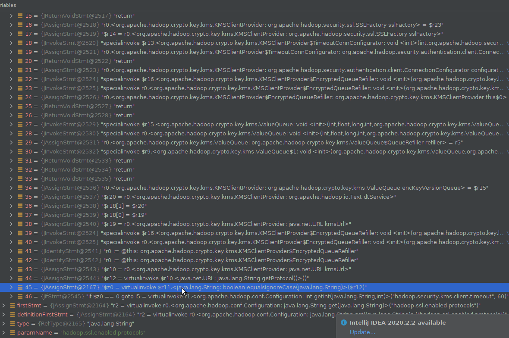

# Case sensitivity check

## Methodology

1. Only string type parameters are considered.
2. `equals` and `equalsIgnoreCase` should not both appear in the usages of the same parameter.
3. The arguments of `equals` for all usages of the same parameter should be all uppercase or all lowercase or all mixture. Otherwise the following inconsistency may happen: 


## Current problem

1. The value of arguments may not be directly presented as strings. Sometimes the arguments are tokens in soot such as r2, $r3. We cannot figure out the concrete value and analyze its case type.

   

   

   After discussion in meeting, we assume that for some cases, the value of token may be able to be achieved. For example, a token $r1 is here in path[2]:

   

   

   The corresponding code in project is

   ```
   "murmur".equalsIgnoreCase(name)
   ```

   So we currently think that if we force to change the type of token or try to do some hacks, it is possible to get the value.

   

   However, under most cases the value cannot be determined that simply. It may not be deterministic so it is impossible to get the concrete value.

   

2. Some usages of `equals` or `equalsIgnoreCase` are not related to the parameter, but they are present in the flow and taken into consideration. Such usages may lead to unnecessary inconsistency warnings. 

   Here is an example. In a flow whose source is `get("hadoop.ssl.enabled.protocol")`, an `equalsIgnoreCase`  appears in the flow after a very very long process.

   

   The corresponding code in project is 

   ```
   if ("https".equalsIgnoreCase(kmsUrl.getProtocol())) 
   ```

   So here the method `equalsIgnoreCase()` is used to compare the value with "http". However, the default value of parameter `"hadoop.ssl.enabled.protocol"` is `"TLSv1,SSLv2Hello,TLSv1.1,TLSv1.2"`, which is obviously irrelevant with "http" . Therefore, the usage of `equalsIgnoreCase()` here has nothing to do with case sensitivity of the parameter. But it is present in the flow, and I currently cannot think out a way to distinguish it from those `equalsIgnoreCase()` which are actually related to the parameter. 

   

3. The result changes when I run the program, which may undermine the correctness of the analysis. In other words, a flow is possible to be present in the outcome, and it is also possible to be not there. 

   2 versions of different logs:
   
   ```
   "hadoop.ssl.client.conf" : 
   "final"(equals)
   
   "bind.address" : 
   "0.0.0.0"(equals)
   
   "hadoop.ssl.hostname.verifier" : 
   "STRICT_IE6"(equals)
   "ALLOW_ALL"(equals)
   "STRICT"(equals)
   "DEFAULT"(equals)
   "DEFAULT_AND_LOCALHOST"(equals)
   
   "zk-dt-secret-manager.zkAuthType" : 
   "none"(equals)
   "sasl"(equals)
   "sasl"(equals)
   
   "hadoop.security.authentication" : 
   $r2(equals)
   $r2(equals)
   $r2(equals)
   
   "fs.ftp.data.connection.mode" : 
   "ACTIVE_LOCAL_DATA_CONNECTION_MODE"(equals)
   "PASSIVE_LOCAL_DATA_CONNECTION_MODE"(equals)
   "PASSIVE_REMOTE_DATA_CONNECTION_MODE"(equals)
   
   "zk-dt-secret-manager.kerberos.principal" : 
   "_HOST"(equals)
   
   "hadoop.kms.http.host" : 
   "0.0.0.0"(equals)
   
   "hadoop.security.dns.nameserver" : 
   "0.0.0.0"(equals)
   
   "fs.defaultFS" : 
   $r14(equals)
   "file:///"(equals)
   
   "hadoop.kms.http.administrators" : 
   "*"(equals)
   
   "nfs.exports.allowed.hosts" : 
   "*"(equals)
   
   "hadoop.util.hash.type" : 
   r0(equalsIgnoreCase)
   r0(equalsIgnoreCase)
   
   "hadoop.ssl.server.conf" : 
   "final"(equals)
   
   "hadoop.security.credential.provider.path" : 
   ""(equals)
   
   "io.compression.codec.bzip2.library" : 
   "java-builtin"(equals)
   
   "hadoop.security.dns.interface" : 
   "0.0.0.0"(equals)
   
   "fs.ftp.transfer.mode" : 
   "STREAM_TRANSFER_MODE"(equals)
   "BLOCK_TRANSFER_MODE"(equals)
   "COMPRESSED_TRANSFER_MODE"(equals)
   
   "tmpjars" : 
   $r14(equals)
   ```
   
   and
   
   ```
   "hadoop.ssl.client.conf" : 
   "fallback"(used in method "equals")
   "property"(used in method "equals")
   "value"(used in method "equals")
   
   "bind.address" : 
   "0.0.0.0"(used in method "equals")
   
   "hadoop.ssl.hostname.verifier" : 
   "STRICT"(used in method "equals")
   "DEFAULT_AND_LOCALHOST"(used in method "equals")
   "STRICT_IE6"(used in method "equals")
   "ALLOW_ALL"(used in method "equals")
   "DEFAULT"(used in method "equals")
   
   "zk-dt-secret-manager.zkAuthType" : 
   "sasl"(used in method "equals")
   "none"(used in method "equals")
   "sasl"(used in method "equals")
   
   "fs.ftp.data.connection.mode" : 
   "ACTIVE_LOCAL_DATA_CONNECTION_MODE"(used in method "equals")
   "PASSIVE_REMOTE_DATA_CONNECTION_MODE"(used in method "equals")
   "PASSIVE_LOCAL_DATA_CONNECTION_MODE"(used in method "equals")
   
   "hadoop.security.authentication" : 
   $r2(used in method "equals")
   $r2(used in method "equals")
   $r2(used in method "equals")
   
   "hadoop.kms.http.host" : 
   "0.0.0.0"(used in method "equals")
   
   "zk-dt-secret-manager.kerberos.principal" : 
   "_HOST"(used in method "equals")
   
   "fs.defaultFS" : 
   "true"(used in method "equalsIgnoreCase")
   r2(used in method "equalsIgnoreCase")
   "file:///"(used in method "equals")
   
   "hadoop.kms.http.administrators" : 
   "*"(used in method "equals")
   
   "hadoop.util.hash.type" : 
   r0(used in method "equalsIgnoreCase")
   r0(used in method "equalsIgnoreCase")
   
   "hadoop.ssl.server.conf" : 
   "fallback"(used in method "equals")
   "property"(used in method "equals")
   "value"(used in method "equals")
   
   "hadoop.security.credential.provider.path" : 
   r1(used in method "equals")
   
   "io.compression.codec.bzip2.library" : 
   "java-builtin"(used in method "equals")
   
   "hadoop.security.key.default.cipher" : 
   "true"(used in method "equalsIgnoreCase")
   r2(used in method "equalsIgnoreCase")
   "fallback"(used in method "equals")
   "property"(used in method "equals")
   "value"(used in method "equals")
   
   "fs.ftp.transfer.mode" : 
   "BLOCK_TRANSFER_MODE"(used in method "equals")
   "COMPRESSED_TRANSFER_MODE"(used in method "equals")
   "STREAM_TRANSFER_MODE"(used in method "equals")
   
   "tmpjars" : 
   "true"(used in method "equalsIgnoreCase")
   r2(used in method "equalsIgnoreCase")
   ```
   
   
   
   Some flows I encountered differ from the flows recorded in  `/flows` of `ccc` repository as well.
   
   Personally, I suspect the phenomenon is due to the balance between correctness and accuracy in soot, and may be related to the set of soot configuration. But it needs more actions and tries to be proved.
